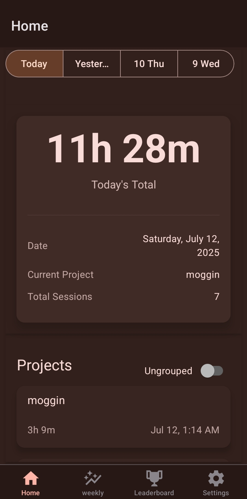
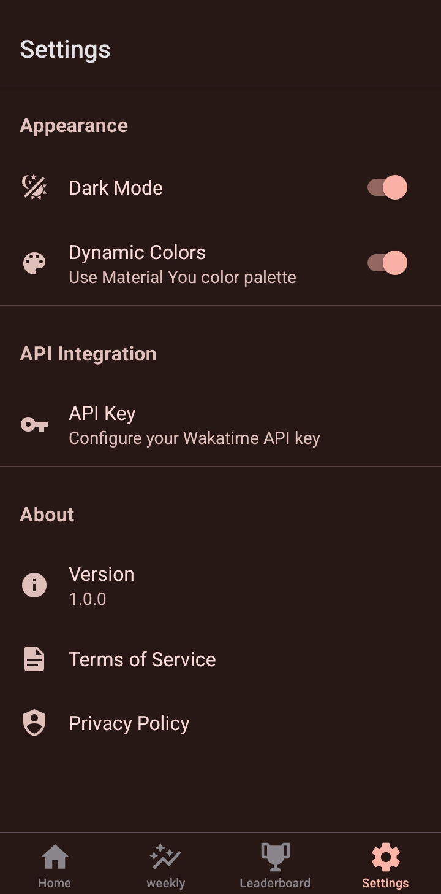
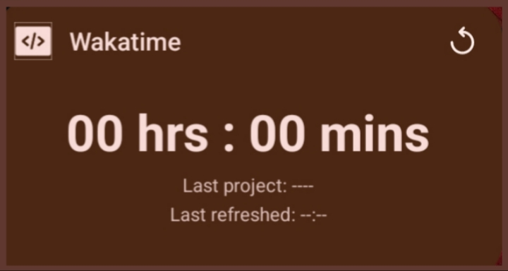
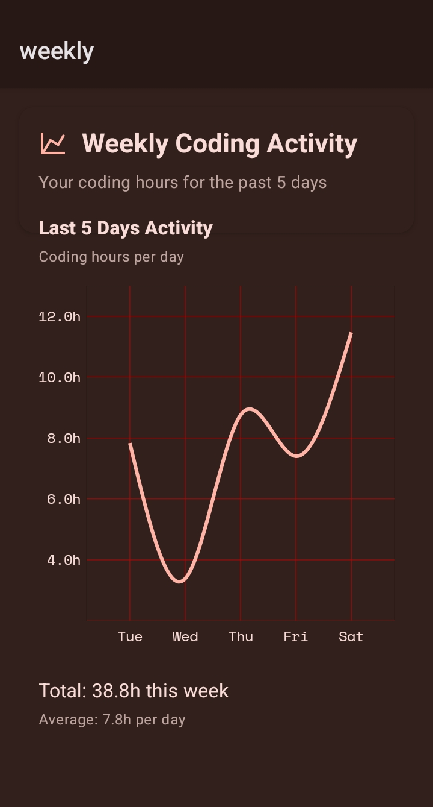
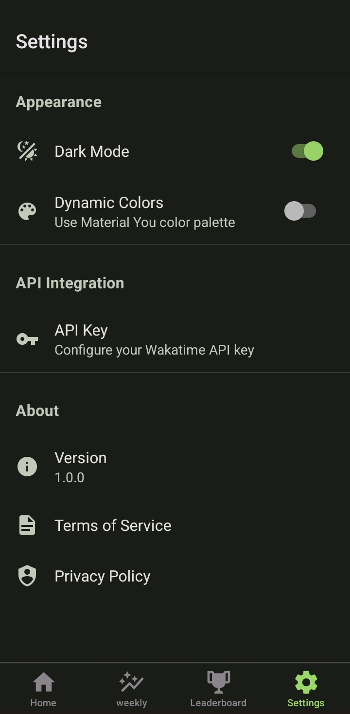

# 📊 Moggin - WakaTime Analytics Dashboard

<div align="center">


</div>

<div align="center">

A beautiful, modern React Native app that provides comprehensive WakaTime analytics with dynamic Material Design 3 theming and native Android widgets. Built with Expo and powered by custom native modules.

</div>

<br>



## ✨ Features

### 📱 **Core Features**
- 🏠 **Dashboard Overview**: Daily coding statistics, project breakdowns, and activity summaries
- 🏆 **Leaderboards**: Global and country-specific WakaTime leaderboards
- 📈 **Weekly Analytics**: Detailed charts showing coding patterns and trends
- ⚙️ **Settings**: App configuration, API key management, and theme controls
- 🔐 **Secure API Management**: Encrypted storage for WakaTime API keys

### 🎨 **Dynamic Theming**
- 🌈 **Material Design 3**: Full Material You dynamic color support
- 📱 **Android 12+ Integration**: Automatically adapts to user's wallpaper colors
- 🌙 **Light/Dark Modes**: Seamless theme switching
- 🎭 **Fallback Themes**: Beautiful themes for unsupported devices

### 📊 **Data Visualization**
- 📈 **Interactive Charts**: Built with Victory Native for smooth animations
- ⏱️ **Time Tracking**: Real-time coding duration displays
- 💻 **Project Analytics**: Breakdown by programming languages and projects
- 🌍 **Global Insights**: Compare your coding activity with other developers

### 🏗️ **Native Integration**
- 🔧 **Android Glance Widgets**: Home screen widgets showing daily coding hours
- 🔄 **Background Updates**: Automatic widget updates using Expo Background Tasks
- 📲 **Deep Integration**: Native Android features with Jetpack Compose

## 🏗️ Architecture

### 🛠️ **Tech Stack**
- **Framework**: React Native with Expo SDK 53
- **Language**: TypeScript 5.8.3
- **UI Library**: React Native Paper with Material Design 3
- **State Management**: Legend State (reactive state management)
- **Data Fetching**: TanStack Query (React Query)
- **Charts**: Victory Native for smooth, interactive data visualizations
- **Navigation**: Expo Router with type-safe routing
- **Storage**: AsyncStorage for secure data persistence

### 🎯 **Custom Native Modules**

#### 1. **Expo Material Dynamic Colors** 📱
Custom native module based on [expo-material3-theme](https://github.com/pchmn/expo-material3-theme) that extracts Android 12+ dynamic colors from the user's wallpaper.

```typescript
// Automatic dynamic theming from wallpaper
const { theme } = useMaterial3Theme();
const paperTheme = useMemo(
  () => colorScheme === 'dark' 
    ? { ...MD3DarkTheme, colors: theme.dark } 
    : { ...MD3LightTheme, colors: theme.light },
  [colorScheme, theme]
);
```

**Features:**
- 🎨 Extracts Material You colors from Android wallpaper
- 🔄 Real-time theme updates when wallpaper changes
- 📱 Fallback themes for iOS and older Android versions
- 🌈 Complete Material Design 3 color tokens
- 🎭 Seamless integration with React Native Paper



#### 2. **Expo WakaTime Glance Widgets** 🔧
Custom native module providing Android Glance widgets that display WakaTime statistics directly on the home screen.

```typescript
// Update widget with latest data
await updateWakatimeWidget({
  totalTime: "8h 45m",
  currentProject: "moggin",
  lastSync: new Date().toISOString()
});
```

**Features:**
- 📱 Native Android Glance widgets
- ⏱️ Real-time coding hours display
- 🔄 Background updates via Expo Background Tasks
- 🎨 Material Design 3 widget styling
- 📊 Shows daily coding statistics



**Technical Implementation:**
- **Jetpack Compose**: Modern Android UI toolkit for widget rendering
- **Glance API**: Official Android widget framework
- **Background Tasks**: Automatic updates using Expo's background task system
- **Config Plugin**: Custom Expo plugin to configure Gradle for Jetpack Compose

### 📂 **Project Structure**

```
moggin/
├── 📱 app/                          # Expo Router pages
│   ├── (provider)/                  # Authentication & providers
│   │   ├── (tabs)/                  # Tab navigation
│   │   │   ├── index.tsx           # Home screen (daily stats)
│   │   │   ├── weekly.tsx          # Weekly analytics
│   │   │   ├── leaderboard.tsx     # Global leaderboards
│   │   │   └── settings.tsx        # App settings
│   │   └── api-keys.tsx            # API key management
│   └── _layout.tsx                 # Root layout
├── 🧩 components/                   # Reusable components
│   ├── screens/                    # Screen-specific components
│   │   ├── home/                   # Daily stats components
│   │   ├── weekly/                 # Weekly charts & analytics
│   │   ├── leaderboards/           # Leaderboard components
│   │   └── settings/               # Settings screens
│   ├── shared/                     # Shared components
│   │   ├── state-screens/          # Loading, error states
│   │   └── svg/                    # Custom SVG icons
│   └── ui/                         # UI primitives
├── 🔧 modules/                      # Custom native modules
│   ├── expo-material-dynamic-colors/
│   │   ├── android/                # Android native code
│   │   ├── src/                    # TypeScript interfaces
│   │   └── expo-module.config.json
│   └── expo-wakatime-glance-widgets/
│       ├── android/                # Widget implementation
│       ├── plugins/                # Expo config plugin
│       └── src/                    # Module exports
├── 📊 lib/                         # Business logic
│   ├── api/                        # API integrations
│   │   └── wakatime/               # WakaTime SDK & hooks
│   ├── datastore/                  # State management
│   └── tanstack/                   # React Query configuration
├── 🎨 assets/                      # Images, fonts, icons
├── 📖 docs/                        # Documentation & screenshots
│   └── images/                     # App screenshots
└── ⚙️ widgets/                     # Widget resources
    └── android/                    # Android widget configuration
```

## 📱 **Screens & Features**

### 🏠 **Home Screen**
Real-time dashboard showing today's coding activity with beautiful animations and Material Design 3 styling.


**Components:**
- 📊 **TodayDuration**: Large, prominent display of daily coding time
- 📅 **WakatimeDayPicker**: Sticky header for date navigation
- 💻 **DailyProjects**: Breakdown of time spent per project
- 🏆 **CurrentUserLeaderboard**: Your position in global rankings
- 🎭 **Beautiful Loading States**: Animated loading indicators and error screens

### 📈 **Weekly Analytics**
Comprehensive weekly coding statistics with interactive charts.



**Features:**
- 📊 **Victory Charts**: Smooth, interactive data visualizations
- 📈 **Activity Patterns**: Daily coding trends and patterns
- 🗓️ **Multi-week Comparison**: Historical data analysis
- 📱 **Responsive Design**: Optimized for all screen sizes

### 🏆 **Leaderboards**
Global and country-specific developer rankings.

**Features:**
- 🌍 **Global Rankings**: See how you compare worldwide
- 🏳️ **Country Filters**: Filter by your country or region
- 👤 **User Profiles**: Detailed developer information
- 🏅 **Achievement System**: Rank icons and badges
- 🔄 **Real-time Updates**: Live leaderboard data

### ⚙️ **Settings Screen**
Comprehensive app configuration with dynamic theming controls.

 

**Features:**
- 🎨 **Theme Controls**: Toggle dynamic colors on/off
- 🔐 **API Key Management**: Secure credential storage
- 📱 **App Preferences**: Customize app behavior
- 🌙 **Dark Mode Toggle**: Manual theme switching

## 🎨 **Design System**

### **Material Design 3 Integration**
The app fully embraces Material Design 3 principles with:

- 🎨 **Dynamic Color**: Colors that adapt to user's wallpaper
- 🎭 **Elevation System**: Proper surface elevation and shadows
- 📝 **Typography Scale**: Complete Material Design type system
- 🔘 **Component Library**: React Native Paper components
- 🎪 **Animations**: Smooth, meaningful motion design

### **Error Handling & Loading States**
Beautiful, animated state screens for all scenarios:

- 🔄 **LoadingFallback**: Animated loading with app logo
- ❌ **NoDataScreen**: Friendly "no data" messaging with illustrations
- 🚫 **UnAuthorizedScreen**: Clear error handling with action buttons
- ⏳ **TooManyRequestsScreen**: Rate limit handling with retry options

## 🚀 **Getting Started**

### **Prerequisites**
- Node.js 18+
- Expo CLI
- Android Studio (for Android development)
- WakaTime account and API key

### **Installation**

1. **Clone the repository**
```bash
git clone https://github.com/yourusername/moggin.git
cd moggin
```

2. **Install dependencies**
```bash
npm install
```

3. **Bundle native modules**
```bash
npm run plugins:bundle
npm run module:bundle
```

4. **Start development server**
```bash
npm start
```

### **Building for Android**

1. **Prebuild with native modules**
```bash
npm run prebuild:android
```

2. **Build and run**
```bash
npm run build:android
```

### **Configuration**

1. **WakaTime API Key**: Get your API key from [WakaTime](https://wakatime.com/api-key)
2. **Add API Key**: Open the app and go to Settings → API Keys
3. **Enable Widgets**: Configure Android widgets from your home screen

## 🔧 **Development**

### **Custom Native Modules**

#### **Material Dynamic Colors Module**
```bash
# Rebuild module after changes
npm run module:bundle
```

#### **Glance Widgets Module**
```bash
# Bundle plugin after changes
npm run plugins:bundle
# Clean and rebuild
npm run prebuild:android
```

### **Background Tasks**
The app uses Expo Background Tasks to update widgets:

```typescript
// Background task for widget updates
TaskManager.defineTask(BACKGROUND_FETCH_TASK, async () => {
  const data = await fetchWakatimeData();
  await updateWakatimeWidget(data);
  return BackgroundFetch.BackgroundFetchResult.NewData;
});
```

## 📊 **State Management**

### **Legend State**
Reactive state management for optimal performance:

```typescript
// Global app state
export const appSettings$ = observable({
  wakatimeApiKey: null as string | null,
  dynamicColorsEnabled: true,
  // ... other settings
});

// React component integration
export function useApiKeysStore() {
  const wakatimeApiKey = appSettings$.wakatimeApiKey.use();
  const setWakatimeApiKey = (key: string | null) => {
    appSettings$.wakatimeApiKey.set(key);
  };
  return { wakatimeApiKey, setWakatimeApiKey };
}
```

### **TanStack Query**
Efficient data fetching with caching:

```typescript
// WakaTime API integration
export function useWakatimeDailyDuration({
  selectedDate,
  wakatimeApiKey,
}: UseWakatimeDailyDurationProps) {
  return useQuery({
    queryKey: ["wakatime-durations", selectedDate, wakatimeApiKey],
    queryFn: () => fetchWakatimeData({ selectedDate, wakatimeApiKey }),
    enabled: !!wakatimeApiKey,
    staleTime: 1000 * 60 * 5, // 5 minutes
  });
}
```

## 🎯 **Performance Optimizations**

- 🎪 **React Native Reanimated**: Smooth 60fps animations
- 📦 **Code Splitting**: Lazy-loaded screens and components
- 🗄️ **Query Caching**: Intelligent data caching with TanStack Query
- 🎭 **Component Memoization**: Optimized re-renders
- 📱 **Native Modules**: Performance-critical features in native code

## 📝 **Contributing**

1. Fork the repository
2. Create a feature branch (`git checkout -b feature/amazing-feature`)
3. Commit your changes (`git commit -m 'Add amazing feature'`)
4. Push to the branch (`git push origin feature/amazing-feature`)
5. Open a Pull Request

## 📄 **License**

This project is licensed under the MIT License - see the [LICENSE](LICENSE) file for details.

## 🙏 **Acknowledgments**

- [expo-material3-theme](https://github.com/pchmn/expo-material3-theme) - Inspiration for dynamic theming
- [WakaTime](https://wakatime.com) - Coding analytics platform
- [React Native Paper](https://callstack.github.io/react-native-paper/) - Material Design components
- [Victory Native](https://commerce.nearform.com/open-source/victory-native/) - Data visualization
- [Legend State](https://legendapp.com/open-source/state/) - State management

---

<div align="center">

**Built with ❤️ using React Native, Expo, and Material Design 3**

</div>
